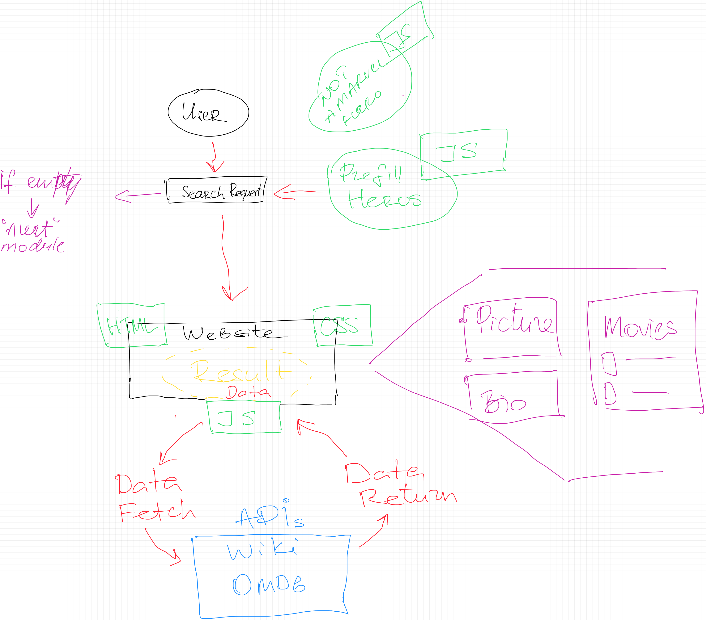

# Team-Project-1
    Coding Bootcamp - Project - 1
 

## Table of Contents
* [Introduction](#introduction)
* [User Story](#userstory)
* [Live URL](#live-url)
* [Walkthrough or What have done so far](#walkthrough)
* [Webpage Preview](#webpage-preview)
* [Contributing](#contributing)
* [Notes](#notes)

 

## Introduction

 

## User Story
**As a** Marvel fan, 
 

**I want to** see media related to my favourite Marvel characters,
 

**So that I** can feel more connected with the Marvel universe. 
 

### Live URL

 

## Walkthrough

 

### Webpage Preview
The following images show the web application's appearance.

 

## Contributing

### Notes

---
© 2021 